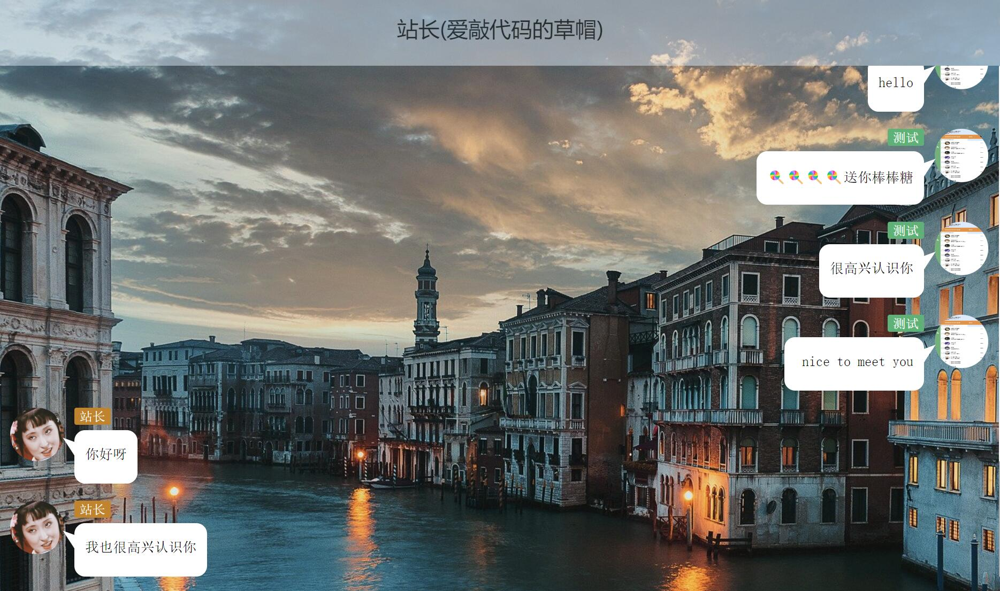
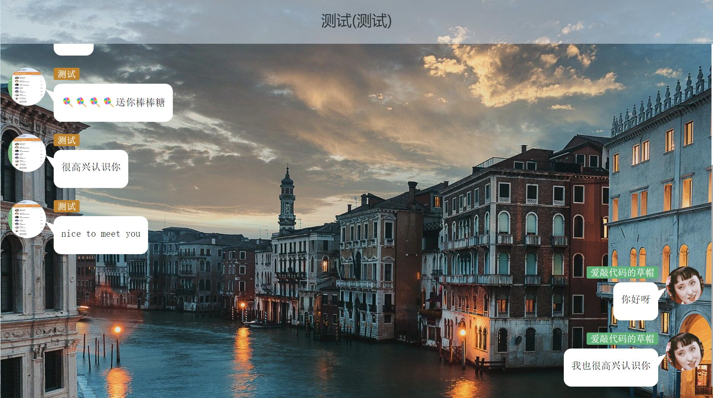
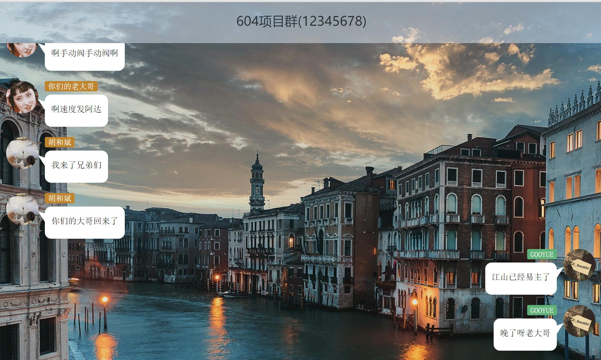
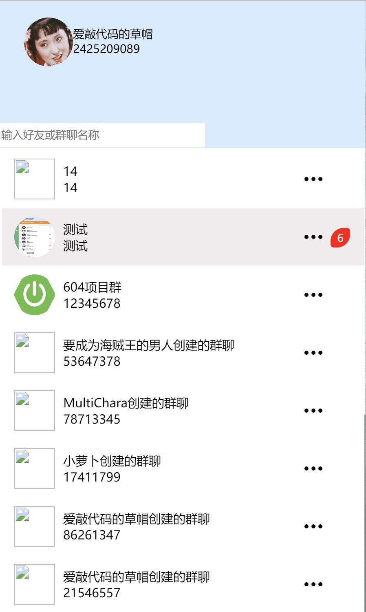
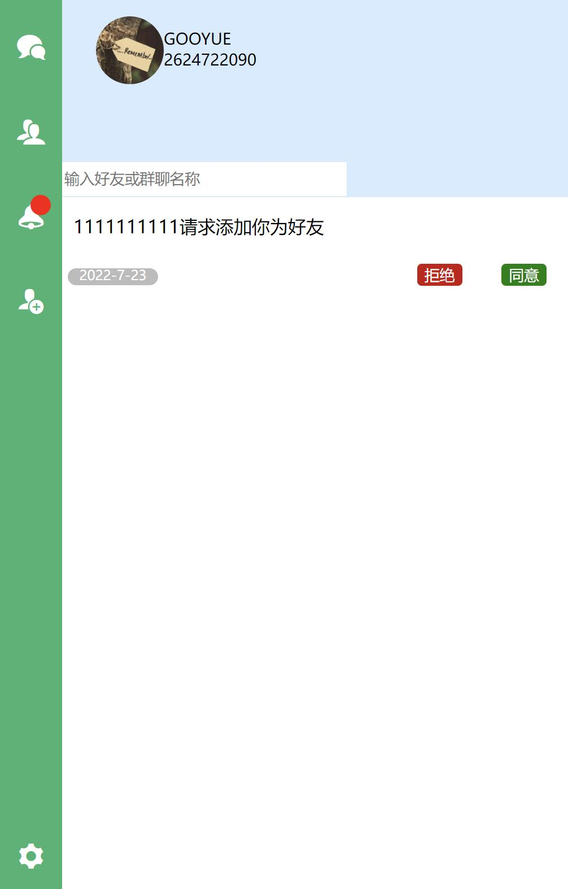
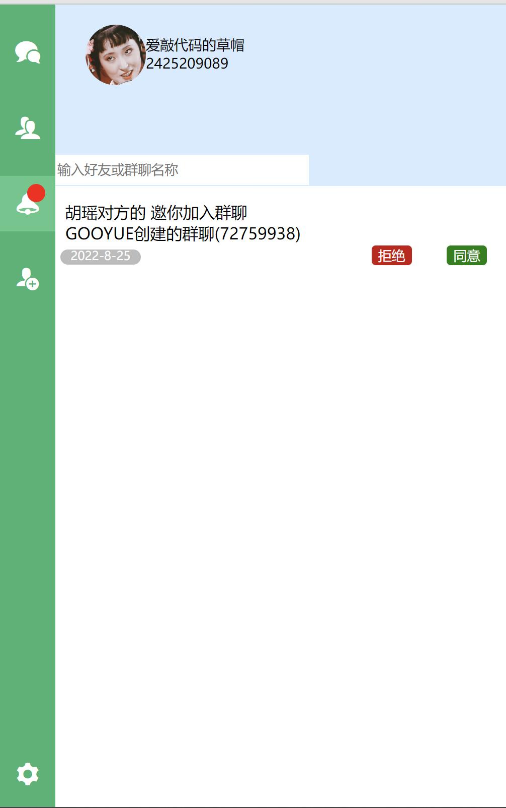
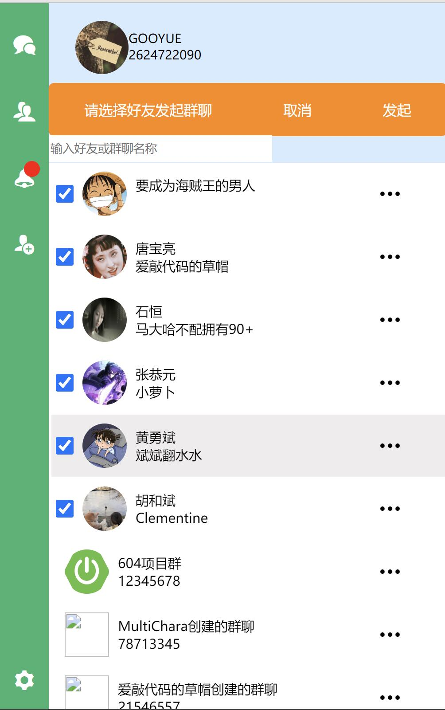
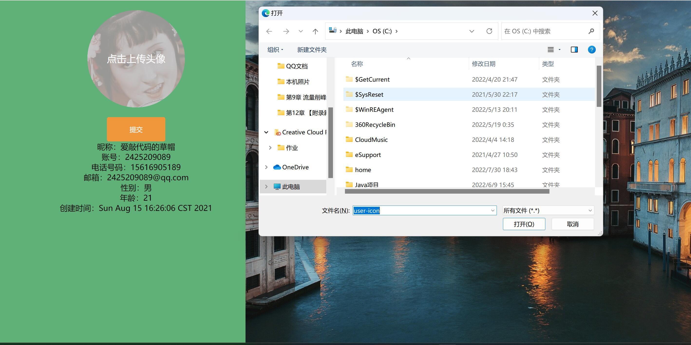

# 基于SpringBoot单一服务架构的实时聊天系统

## 在线演示地址

http://47.105.162.109

## 软件框架

SpringBoot+MyBatis+Thymeleaf+JQuery
## 关键通信协议

websocket
实现了服务器到客户端的实时通信
不同于http协议，websocket能够实现全双工通信，客户端可以向服务器发送服务器也可以主动向客户端发送
## 实现功能

1. [X] 一对一聊天消息
2. [X] 多人互动聊天消息
3. [X] 好友申请消息及同意拒绝
4. [X] 群聊邀请消息及同意拒绝
5. [X] 头像上传基于 Tomcat 的内置静态内容服务
6. [ ] 采用分布式架构引入消息队列
7. [ ] 使用前后端分离技术
8. [ ] 语音通话功能
9. [ ] 视频会议和通话功能

## 软件版本

MySQL 8.0.25
tomcat springboot内嵌
## 数据库连接技术

使用了Druid数据库连接池，减轻了服务器频繁建立数据库连接的负担

## 前端技术

1.流式布局技术
2.字体图标技术
3.js框架Jquery
4.前后端交互：Jquery封装的Ajax

## 项目演示

### 一对一实时通信

### 上传头像

### 多人群聊互动

### 收到未读消息

### 收到好友邀请

### 收到群聊邀请

### 发起群聊邀请并创建群聊

### 上传头像

